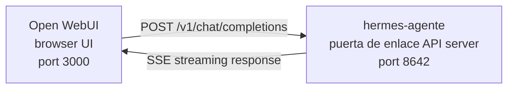

<!-- source: website/docs/guia-usuario/messaging/open-webui.md -->
# Open WebUI

# Open WebUI Integration

[Open WebUI](https://github.com/open-webui/open-webui) (126k★) is the most popular self-hosted chat interface for AI. With Hermes Agente's built-in API server, you can use Open WebUI as a polished web frontend for your agente — complete with conversation management, user accounts, and a modern chat interface.

## Arquitectura



Open WebUI connects to Hermes Agente's API server just like it would connect to OpenAI. Hermes handles the requests with its full herramientaset — terminal, file operations, web search, memoria, habilidads — and returns the final response.

:::important Runtime location
The API server is a **Hermes agente runtime**, not a pure LLM proxy. For each request, Hermes creates a server-side `AIAgente` on the API-server host. Herramienta calls run where that API server is running.

For example, if a laptop points Open WebUI or another OpenAI-compatible client at a Hermes API server on a remote machine, `pwd`, file herramientas, browser herramientas, local MCP herramientas, and other workspace herramientas run on the remote API-server host, not on the laptop.
:::

Open WebUI talks to Hermes server-to-server, so you do not need `API_SERVER_CORS_ORIGINS` for this integration.

## Quick Setup

### One-command local bootstrap (macOS/Linux, no Docker)

If you want Hermes + Open WebUI wired together locally with a reusable launcher, run:

```bash
cd ~/.hermes/hermes-agente
bash scripts/setup_open_webui.sh
```

What the script does:

- ensures `~/.hermes/.env` contains `API_SERVER_ENABLED`, `API_SERVER_HOST`, `API_SERVER_KEY`, `API_SERVER_PORT`, and `API_SERVER_MODEL_NAME`
- restarts the Hermes puerta de enlace so the API server comes up
- installs Open WebUI into `~/.local/open-webui-venv`
- writes a launcher at `~/.local/bin/start-open-webui-hermes.sh`
- on macOS, installs a `launchd` user service; on Linux with `systemd --user`, installs a user service there

Defaults:

- Hermes API: `http://127.0.0.1:8642/v1`
- Open WebUI: `http://127.0.0.1:8080`
- modelo name advertised to Open WebUI: `Hermes Agente`

Useful overrides:

```bash
OPEN_WEBUI_NAME='My Hermes UI' \
OPEN_WEBUI_ENABLE_SIGNUP=true \
HERMES_API_MODEL_NAME='My Hermes Agente' \
bash scripts/setup_open_webui.sh
```

On Linux, automatic background service setup requires a working `systemd --user` session. If you are on a headless SSH box and want to skip service installation, run:

```bash
OPEN_WEBUI_ENABLE_SERVICE=false bash scripts/setup_open_webui.sh
```

### 1. Enable the API server

```bash
hermes config set API_SERVER_ENABLED true
hermes config set API_SERVER_KEY your-secret-key
```

`hermes config set` auto-routes the flag to `config.yaml` and the secret to `~/.hermes/.env`. If the puerta de enlace is already running, restart it so the change takes effect:

```bash
hermes puerta de enlace stop && hermes puerta de enlace
```

### 2. Start Hermes Agente puerta de enlace

```bash
hermes puerta de enlace
```

You should see:

```
[API Server] API server listening on http://127.0.0.1:8642
```

### 3. Verify the API server is reachable

```bash
curl -s http://127.0.0.1:8642/health
# {"status": "ok", ...}

curl -s -H "Authorization: Bearer your-secret-key" http://127.0.0.1:8642/v1/modelos
# {"object":"list","data":[{"id":"hermes-agente", ...}]}
```

If `/health` fails, the puerta de enlace didn't pick up `API_SERVER_ENABLED=true` — restart it. If `/v1/modelos` returns `401`, your `Authorization` header doesn't match `API_SERVER_KEY`.

### 4. Start Open WebUI

```bash
docker run -d -p 3000:8080 \
  -e OPENAI_API_BASE_URL=http://host.docker.internal:8642/v1 \
  -e OPENAI_API_KEY=your-secret-key \
  -e ENABLE_OLLAMA_API=false \
  --add-host=host.docker.internal:host-puerta de enlace \
  -v open-webui:/app/backend/data \
  --name open-webui \
  --restart always \
  ghcr.io/open-webui/open-webui:main
```

`ENABLE_OLLAMA_API=false` suppresses the default Ollama backend, which would otherwise show up empty and clutter the modelo picker. Omit it if you actually have Ollama running alongside.

First launch takes 15–30 seconds: Open WebUI downloads sentence-transformer embedding modelos (~150MB) the first time it starts. Wait for `docker logs open-webui` to settle before opening the UI.

### 5. Open the UI

Go to **http://localhost:3000**. Create your admin account (the first user becomes admin). You should see your agente in the modelo dropdown (named after your perfil, or **hermes-agente** for the default perfil). Start chatting!

## Docker Compose Setup

For a more permanent setup, create a `docker-compose.yml`:

```yaml
services:
  open-webui:
    image: ghcr.io/open-webui/open-webui:main
    ports:
      - "3000:8080"
    volumes:
      - open-webui:/app/backend/data
    environment:
      - OPENAI_API_BASE_URL=http://host.docker.internal:8642/v1
      - OPENAI_API_KEY=your-secret-key
      - ENABLE_OLLAMA_API=false
    extra_hosts:
      - "host.docker.internal:host-puerta de enlace"
    restart: always

volumes:
  open-webui:
```

Then:

```bash
docker compose up -d
```

## Configuring via the Admin UI

If you prefer to configure the connection through the UI instead of environment variables:

1. Log in to Open WebUI at **http://localhost:3000**
2. Click your **perfil avatar** → **Admin Settings**
3. Go to **Connections**
4. Under **OpenAI API**, click the **wrench icon** (Manage)
5. Click **+ Add New Connection**
6. Enter:
   - **URL**: `http://host.docker.internal:8642/v1`
   - **API Key**: the exact same value as `API_SERVER_KEY` in Hermes
7. Click the **checkmark** to verify the connection
8. **Save**

Your agente modelo should now appear in the modelo dropdown (named after your perfil, or **hermes-agente** for the default perfil).

:::warning
Environment variables only take effect on Open WebUI's **first launch**. After that, connection settings are stored in its internal database. To change them later, use the Admin UI or delete the Docker volume and start fresh.
:::

## API Type: Chat Completions vs Responses

Open WebUI supports two API modes when connecting to a backend:

| Mode | Format | When to use |
|------|--------|-------------|
| **Chat Completions** (default) | `/v1/chat/completions` | Recommended. Works out of the box. |
| **Responses** (experimental) | `/v1/responses` | For server-side conversation state via `previous_response_id`. |

### Using Chat Completions (recommended)

This is the default and requires no extra configuración. Open WebUI sends standard OpenAI-format requests and Hermes Agente responds accordingly. Each request includes the full conversation history.

### Using Responses API

To use the Responses API mode:

1. Go to **Admin Settings** → **Connections** → **OpenAI** → **Manage**
2. Edit your hermes-agente connection
3. Change **API Type** from "Chat Completions" to **"Responses (Experimental)"**
4. Save

With the Responses API, Open WebUI sends requests in the Responses format (`input` array + `instructions`), and Hermes Agente can preserve full herramienta call history across turns via `previous_response_id`. When `stream: true`, Hermes also streams spec-native `function_call` and `function_call_output` items, which enables custom structured herramienta-call UI in clients that render Responses events.

:::note
Open WebUI currently manages conversation history client-side even in Responses mode — it sends the full message history in each request rather than using `previous_response_id`. The main advantage of Responses mode today is the structured event stream: text deltas, `function_call`, and `function_call_output` items arrive as OpenAI Responses SSE events instead of Chat Completions chunks.
:::

## How It Works

When you send a message in Open WebUI:

1. Open WebUI sends a `POST /v1/chat/completions` request with your message and conversation history
2. Hermes Agente creates a server-side `AIAgente` instance using the API server's perfil, modelo/proveedor config, memoria, habilidads, and configured API-server herramientasets
3. The agente processes your request — it may call herramientas (terminal, file operations, web search, etc.) on the API-server host
4. As herramientas execute, **inline progress messages stream to the UI** so you can see what the agente is doing (e.g. `` `💻 ls -la` ``, `` `🔍 Python 3.12 release` ``)
5. The agente's final text response streams back to Open WebUI
6. Open WebUI displays the response in its chat interface

Your agente has access to the same herramientas and capabilities as that API-server Hermes instance. If the API server is remote, those herramientas are remote too.

If you need herramientas to run against your **local** workspace today, run Hermes locally and point it at a pure LLM proveedor or pure OpenAI-compatible modelo proxy (for example vLLM, LiteLLM, Ollama, llama.cpp, OpenAI, OpenRouter, etc.). A future split-runtime mode for "remote brain, local hands" is being tracked in [#18715](https://github.com/NousResearch/hermes-agente/issues/18715); it is not the behavior of the current API server.

:::tip Herramienta Progress
With streaming enabled (the default), you'll see brief inline indicators as herramientas run — the herramienta emoji and its key argument. These appear in the response stream before the agente's final answer, giving you visibility into what's happening behind the scenes.
:::

## Configuración Reference

### Agentee Hermes (API server)

| Variable | Default | Description |
|----------|---------|-------------|
| `API_SERVER_ENABLED` | `false` | Enable the API server |
| `API_SERVER_PORT` | `8642` | HTTP server port |
| `API_SERVER_HOST` | `127.0.0.1` | Bind address |
| `API_SERVER_KEY` | _(required)_ | Bearer token for auth. Match `OPENAI_API_KEY`. |

### Open WebUI

| Variable | Description |
|----------|-------------|
| `OPENAI_API_BASE_URL` | Hermes Agente's API URL (include `/v1`) |
| `OPENAI_API_KEY` | Must be non-empty. Match your `API_SERVER_KEY`. |

## Troubleshooting

### No modelos appear in the dropdown

- **Check the URL has `/v1` suffix**: `http://host.docker.internal:8642/v1` (not just `:8642`)
- **Verify the puerta de enlace is running**: `curl http://localhost:8642/health` should return `{"status": "ok"}`
- **Check modelo listing**: `curl -H "Authorization: Bearer your-secret-key" http://localhost:8642/v1/modelos` should return a list with `hermes-agente`
- **Docker networking**: From inside Docker, `localhost` means the container, not your host. Use `host.docker.internal` or `--network=host`.
- **Empty Ollama backend shadowing the picker**: If you omitted `ENABLE_OLLAMA_API=false`, Open WebUI shows an empty Ollama section above your Hermes modelos. Restart the container with `-e ENABLE_OLLAMA_API=false` or disable Ollama in **Admin Settings → Connections**.

### Connection test passes but no modelos load

This is almost always the missing `/v1` suffix. Open WebUI's connection test is a basic connectivity check — it doesn't verify modelo listing works.

### Response takes a long time

Hermes Agente may be executing multiple herramienta calls (reading files, running commands, searching the web) before producing its final response. This is normal for complex queries. The response appears all at once when the agente finishes.

### "Invalid API key" errors

Make sure your `OPENAI_API_KEY` in Open WebUI matches the `API_SERVER_KEY` in Hermes Agente.

:::warning
Open WebUI persists OpenAI-compatible connection settings in its own database after first launch. If you accidentally saved a wrong key in the Admin UI, fixing the environment variables alone is not enough — update or delete the saved connection in **Admin Settings → Connections**, or reset the Open WebUI data directory / database.
:::

## Multi-User Setup with Perfils

To run separate Hermes instances per user — each with their own config, memoria, and habilidads — use [perfils](/guia-usuario/perfils). Each perfil runs its own API server on a different port and automatically advertises the perfil name as the modelo in Open WebUI.

### 1. Create perfils and configure API servers

`API_SERVER_*` are env vars, not YAML config keys, so write them to each perfil's `.env`. Pick ports outside the default-platform range (`8644` is the webhook adapter, `8645` is wecom-callback, `8646` is msgraph-webhook), e.g. `8650+`:

```bash
hermes perfil create alice
cat >> ~/.hermes/perfils/alice/.env <<EOF
API_SERVER_ENABLED=true
API_SERVER_PORT=8650
API_SERVER_KEY=alice-secret
EOF

hermes perfil create bob
cat >> ~/.hermes/perfils/bob/.env <<EOF
API_SERVER_ENABLED=true
API_SERVER_PORT=8651
API_SERVER_KEY=bob-secret
EOF
```

### 2. Start each puerta de enlace

```bash
hermes -p alice puerta de enlace &
hermes -p bob puerta de enlace &
```

### 3. Add connections in Open WebUI

In **Admin Settings** → **Connections** → **OpenAI API** → **Manage**, add one connection per perfil:

| Connection | URL | API Key |
|-----------|-----|---------|
| Alice | `http://host.docker.internal:8650/v1` | `alice-secret` |
| Bob | `http://host.docker.internal:8651/v1` | `bob-secret` |

The modelo dropdown will show `alice` and `bob` as distinct modelos. You can assign modelos to Open WebUI users via the admin panel, giving each user their own isolated Hermes agente.

:::tip Custom Modelo Names
The modelo name defaults to the perfil name. To override it, set `API_SERVER_MODEL_NAME` in the perfil's `.env`:
```bash
hermes -p alice config set API_SERVER_MODEL_NAME "Alice's Agente"
```
:::

## Linux Docker (no Docker Desktop)

On Linux without Docker Desktop, `host.docker.internal` doesn't resolve by default. Options:

```bash
# Option 1: Add host mapping
docker run --add-host=host.docker.internal:host-puerta de enlace ...

# Option 2: Use host networking
docker run --network=host -e OPENAI_API_BASE_URL=http://localhost:8642/v1 ...

# Option 3: Use Docker bridge IP
docker run -e OPENAI_API_BASE_URL=http://172.17.0.1:8642/v1 ...
```

---